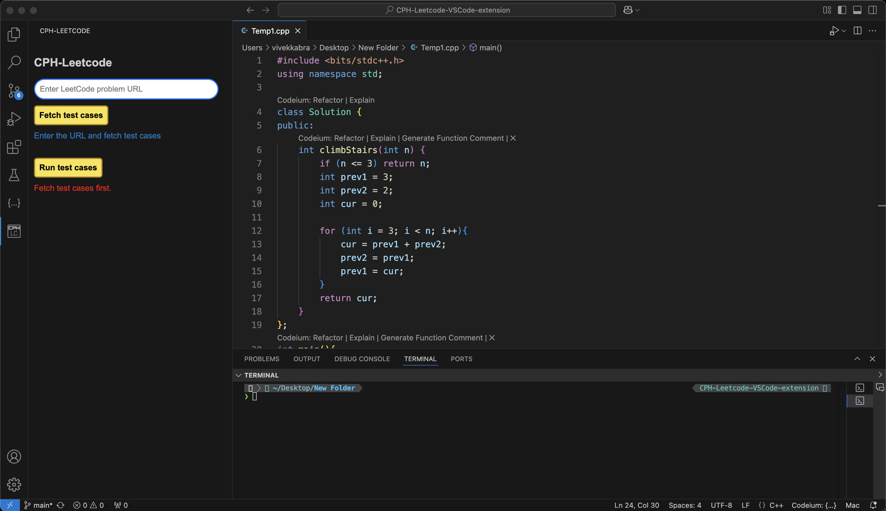
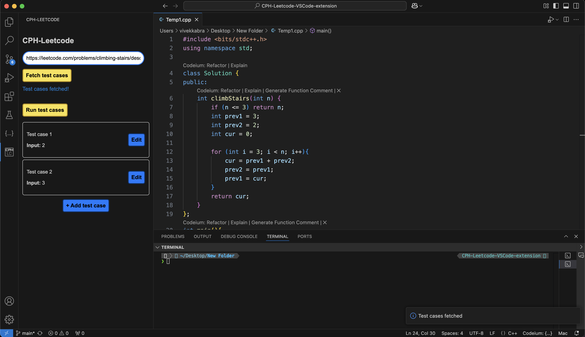
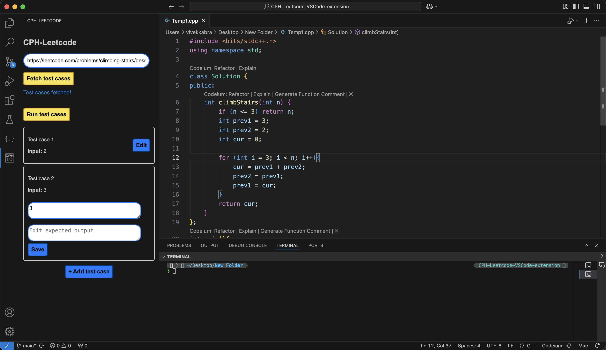
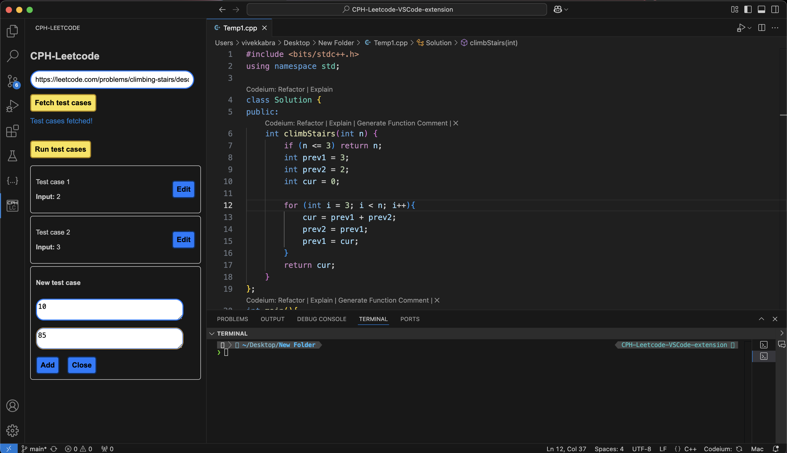
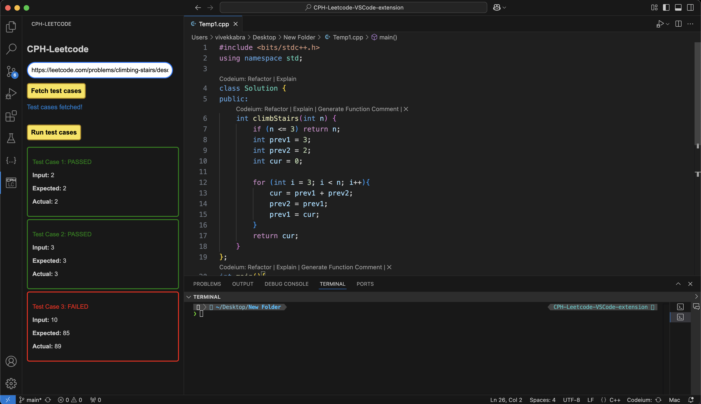

# CPH LeetCode
A Visual Studio Code extension for simplifying test case management and execution for LeetCode problems.

## Overview
CPH-Leetcode enhances your LeetCode workflow directly within Visual Studio Code by automating test case fetching, editing, adding and execution. This extension is especially useful for competitive programmers and developers who frequently work with LeetCode problems.

## Built with

## Features
- Fetch test cases directly from a LeetCode problem URL.
- Edit test cases dynamically within VS Code itself.
- Run test cases locally and view detailed results.
- Add your own test case(s) to run.
- Can run code in C++, Python or Java.

## Installation
1. Download the extension file (.vsix) from the download link.
- Download link: [CPH LeetCode](https://github.com/vivek-kabra/CPH-Leetcode-VSCode-extension/raw/refs/heads/main/cph-leetcode/cph-leetcode-0.0.1.vsix)

2. Open Visual Studio Code.
3. Click on the 'Extensions' option present in the left side panel of the window.
4. Drag and drop the downloaded extension file into the 'Extensions' window to install
OR
Click on the three dots at the top right -> `Install from VSIX...`
5. The extension will be installed. Reload the Visual Studio window so that the extension's icon appears in the left panel.
    
## Usage
1. Open the extension panel
- After installation, open the extension from extension panel.
2. Fetch test cases
- Enter the LeetCode problem URL in the input field.
- Click the `Fetch test cases` button to retrieve test cases.
3. Edit/Add test cases
- Use the `Edit` button to modify existing test cases.
- Add new test case(s) using the `+ Add test case` button.
4. Run test cases
- Click the `Run test cases` button to execute all test cases locally and view the status whether passed or failed.

## Screenshots
#### Main view:

#### Test cases fetched:

#### Edit test case:

#### Add test case:

#### Run test cases:

## Troubleshooting
#### Common issues:
1. Test cases not fetched
- Ensure the provided URL is valid and accessible.
2. Extension not loading
- The extension may not have been installed correctly or conflicts with other extensions.
- Try reloading VS Code window (Cmd+Shift+P/Ctrl+Shift+P, then Reload window) or restart VS Code.

## Acknowledgements
 Thanks to Visual Studio Code, LeetCode and their communities for their tools and API.

